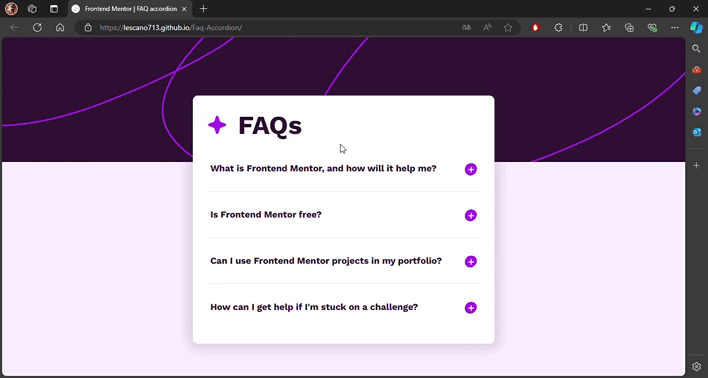

# Frontend Mentor - FAQ accordion solution

<div align="left">
  <a href="https://www.linkedin.com/in/danae-lescano-salvatierra" target="_blank">
    
  </a>
  <a href="https://lescano713.github.io/Faq-Accordion/" target="_blank">
    
  </a>
  <a href="https://www.frontendmentor.io/profile/Lescano713" target="_blank">
    
  </a>
</div>

## Table of contents

- [Overview](#overview)
  - [The challenge](#the-challenge)
  - [Screenshot](#screenshot)
- [My process](#my-process)
  - [Built with](#built-with)
  - [What I learned](#what-i-learned)
  - [Continued development](#continued-development)

## Overview

### The challenge

Users should be able to:

- Hide/Show the answer to a question when the question is clicked
- Navigate the questions and hide/show answers using keyboard navigation alone
- View the optimal layout for the interface depending on their device's screen size
- See hover and focus states for all interactive elements on the page

### Screenshot




## My process

### Built with

- Semantic HTML5 markup
- CSS custom properties
- Flexbox
- CSS Grid
- Mobile-first workflow
- JavaScript
- EventListener


### What I learned

<p>I learned how to apply styles to different child elements of the same parent.</p>

```css
main #faqs-container .toggle{
    .button-question{
        .icon-container{
            background-image: url('./assets/images/icon-minus.svg');
        }
    }
    .div-answer{
        display: block;
    }
}
```
<p>I explored the use of ARIA labels to make the page more accessible and improve navigation for users with screen readers.</p>

```js
buttonQuestion.setAttribute('aria-expanded', 'false');
buttonQuestion.setAttribute('aria-controls',`answer-id${index}`)
```
<p>I practiced using a switch statement instead of multiple if conditions, and I implemented keyboard functionality for better user interaction.</p>

```js
function keyDown(e,index,buttons){
    switch (e.key) {
        case ' ':
            e.preventDefault();
            buttons[index].click();
            break;
        case 'ArrowUp':
            e.preventDefault();
            if (index > 0) {
                buttons[index -1].focus()
            }
            break;

        case 'ArrowDown':
            e.preventDefault();
            if (index < buttons.length -1) {
                buttons[index+1].focus()
            }
        break;
    
        default:
            break;
    }
}
```


### Continued development

<b>Advanced CSS Techniques:</b>
<p>I want to explore more advanced pseudo-selectors and combinators. I also aim to learn about CSS Grid and Flexbox to handle more complex layouts.</p>

<b>JavaScript Enhancements:</b>
<p>I plan to practice handling different user inputs and validation scenarios. I want to refine my understanding of JavaScript events and form handling.</p>

<b>Accessibility Improvements:</b>
<p>I need to ensure that my forms and interactive elements are accessible to all users, including those using assistive technologies.</p>

<b>Responsive Design:</b>
<p>I’ll work on making my designs responsive to different screen sizes and devices.</p>


